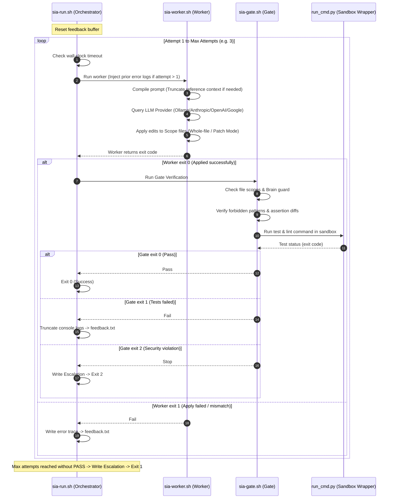

# SIA Architecture & Technical Deep Dive (ARCHITECTURE.md)

This document provides a comprehensive technical overview of the **SIA (Asymmetric Execution Framework)**. It is designed for developers, architects, and technical recruiters to understand the inner workings, security boundaries, and token optimization strategies of the framework.

---

## 🏛️ 1. Core Philosophy: Asymmetric Execution

In standard AI-agent workflows, a single LLM acts as the planner, coder, and validator. This approach leads to **context drift** and **high failure rates** when models attempt to edit files while simultaneously tracking complex business invariants.

SIA solves this by separating tasks into two distinct, asymmetric cognitive layers:

```
┌────────────────────────────────────────────────────────┐
│                   Architect (High LLM)                 │
│      - Writes TASK-XXX.md (Scope, Invariants, DoD)     │
│      - Manages Rules in wiki/                          │
└──────────────────────────┬─────────────────────────────┘
                           │
                 Generates Task Contract
                           │
                           ▼
┌────────────────────────────────────────────────────────┐
│                   Worker (Local LLM)                   │
│      - Scoped Read-Write Access                        │
│      - Execution Gate (Tests, Lint, Security Check)     │
└────────────────────────────────────────────────────────┘
```

1. **The Architect (Cognitive/Planning Layer)**: Uses a highly capable reasoning model (e.g., Claude 3.7 Sonnet, o1) to analyze requirements, verify constraints, and write a strict **task contract** (`TASK-XXX.md`).
2. **The Worker (Execution Layer)**: Uses a fast, cost-efficient, or local coding model (e.g., Qwen2.5-Coder:14b, Claude Haiku) to implement code changes. The worker has **READ-ONLY** access to system rules and is **confined to the file-scope** defined by the Architect.

---

## 🔄 2. Execution Loop & Lifecycle

The runtime loop is managed by `sia-run.sh`, which coordinates the stateless worker (`sia-worker.sh`) and the deterministic verification gate (`sia-gate.sh`).



---

## 🪙 3. Token Optimization & Cost Efficiency

AI agents often burn through millions of tokens by outputting duplicate code or reading bloated logs. SIA implements five strict layers of token budgeting:

### A. Patch Mode (Aider-style SEARCH/REPLACE)
Instead of forcing the LLM to rewrite a 1000-line file to edit a single line, SIA prompts the model to emit minimal block deltas:
```text
<<<<<<< SEARCH
old lines of code
=======
new lines of code
>>>>>>> REPLACE
```
* **Efficiency**: Reduces output tokens by up to **80% to 90%**, accelerating completion speed and lowering API costs.
* **Safety**: Applied atomically via `sia_apply.py` (all-or-nothing). If a block fails to match exactly once, it rolls back and alerts the loop.

### B. Feedback Log Truncation
When unit tests or linters fail, the console output can be massive. SIA parses the log file via `truncate_feedback` in Python:
* Retains the first **30 lines** (typically containing the test runner summary and compilation errors).
* Retains the last **120 lines** (typically containing the failed assertion stack trace).
* Discards the middle lines, inserting an omission marker.

### C. Context Truncation & Budgeting
Prompt compiling (`context_builder.py`) calculates the prompt length against the target model's context window (`SIA_ACTIVE_NUM_CTX * budget_pct`):
1. **Scope Files** (files to edit) are **never truncated** to prevent data loss.
2. **Repository Map** is dropped if the total size exceeds the budget.
3. **Reference Context Files** are truncated dynamically (keeping 60% head and 20% tail) to fit the remaining token budget.

---

## 🔒 4. Hardened Security & Sandboxing

SIA treats LLM-generated code as untrusted input. Commands are never evaluated directly in the host shell.

### A. The Command Sandbox Wrapper (`run_cmd.py`)
All test and lint commands are run through a Python subprocess manager supporting three sandboxing profiles:
1. **`"none"`**: Standard local execution (with process group killing on timeout).
2. **`"docker"`**: Launches a container with network disabled (`--network none`), mapping the host workspace to `/work`, running under the host user UID/GID to avoid root ownership file pollution.
3. **`"sandbox-exec"`**: Utilizes native macOS kernel-level sandbox profiles (`sia.sb`) to deny file write access to system directories.

### B. The Assertion-Diff Check (Anti-Cheat)
A common failure mode for AI models when faced with failing tests is to "cheat" by editing or deleting the test files themselves. The `sia-gate.sh` parses `git diff` and rejects any changes that remove standard assertion tokens (e.g. `expect`, `assert`, `toEqual`).

---

## 🛠️ 5. Agile Folder Customization

While SIA integrates perfectly with an Obsidian-style digital garden (using the `.brain/` naming convention), it is fully folder-agnostic. The `paths` block in `sia.json` allows teams to adapt SIA to their own folder conventions (e.g., using `.claude/` or `.github/` directories):

```json
  "paths": {
    "brain_dir": ".sia",
    "tasks_dir": ".sia/tasks",
    "worker_dir": ".sia-worker",
    "runs_dir": ".sia-worker/runs",
    "escalations_dir": ".sia-worker/escalations"
  }
```
If omitted, the framework gracefully defaults to `.brain` and `.worker` folders to maintain full backward compatibility.
